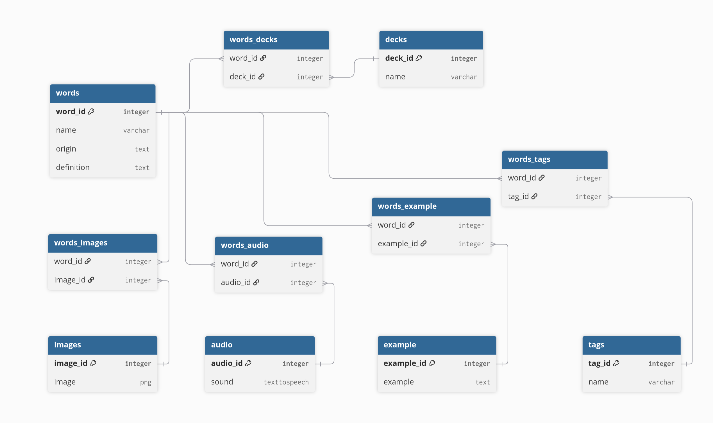

Purpose of a logical model: The purpose of a logical model is to determine how information will be structured in a database and the relationships between them.

Primary Key: A combination of terms that allow access to specific parts of a table.

Foreign key: A key that is not the primary key for a given table.

Relationships between entities: Entities traditionally can have 1 to many, many to many, or 1 to 1 relationships.

Normalization: To design a table in a way that prevents the creation of redundant information and anomalies (deletion, insertion, update). Also allows for information to be more easily understood and expandable. Comes in the forms 1NF to 5NF, higher forms require lower forms to be satisified first.

Group Conceptual model:

[Group Conceptual Model](https://github.com/OfficeCoffee/mouseion-database/blob/main/docs/conceptual-model/official-conceptual-model.jpg)

Logical model: 

Logical Model Description:

The model shows words, the decks they are contained in, and all the entites related to words (images, audio, examples, and tags). Being that all these entities have many to many relationships, junction tables were used to link these entities by a one to many relationship. For example, word_id and deck_id are contained in a separate table called words_decks. This allows for the many to many relationships words/decks would normally have to be joined by two one to many relationships.
