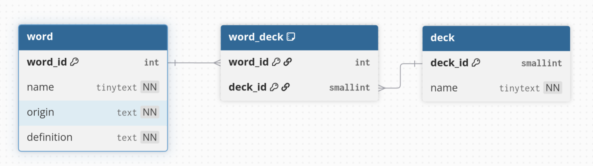

Key difference of the physical model compared to the conceptual and logical models:
	- A key difference of the physical model is the inclusion of datatypes. A specific data base must also be chosen to determine what datatypes designers have access to.

What are the common data types:
	- Common data types in MariaDB include: SMALLINT, INT, TINYTEXT, TEXT, DATETIME, and TIMESTAMP
	- Common data types in SQL include: CHAR(), VARCHAR(), DEC(#,#), and TINYINT 
Default values / Null values:
	- Default values are values set by the database when no input is specified. Null values specify if a column requires a value to be set (NOTNULL = requires value, NULL = no value required).

Check constraints:
	- Check values/constraints refer to when a column must be in a specific range or can only be a set of specific inputs. Example: grades IN(A, B, C, D, F).

Group Logical model:

https://github.com/OfficeCoffee/mouseion-database/tree/group-LogicalModel/groupLogicalModelMVP

Physical model:

Description:

	- The diagram shows the minimum viable product for the physical model. The word table shows word_id (primary key) name, origin, and definition where all these columns are listed as NOT NULL (NN). The deck table shows deck_id and name where name is NOT NULL. Finally, the word_deck table has word_id and deck_id both as primary keys to join the word and deck tables. word_deck also allows for the words/decks many to many relationship to be joined by two one to many relationships.
