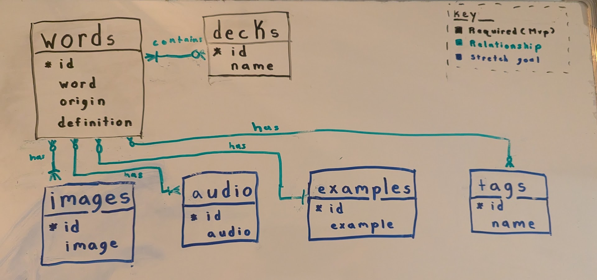
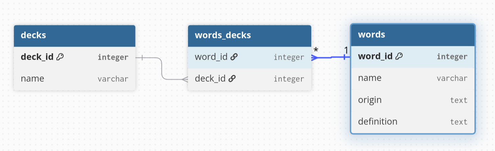

# **Conceptual Model**

**Description**: 

Our conceptual model includes MVP entities and stretch goal entities. At minimum, we want an app that can have decks that can store words. Optionally, words can contain images, audio, examples, and tags.

| Entity | Definition | Relationship |
| -------- | -------- | -------- |
| words | The word itself | Can have zero to many images, audio, examples, and tags. Can also belong to multiple decks, but it must belong to one deck. |
| decks | Individual decks of words | May contain zero or more words (N:N) |
| images | A displayed image belonging to a word | Can be associated with multiple words (N:N). An image must belong to at least one word. |
| audio | Audio file belonging to a word | Can be associated with multiple words (N:N). Audio must belong to at least one word. |
| examples | A clear statement that illustrates the usages of a word | A word can have many examples, but an example is unique to a word (N:1) |
| tags | An identifier for a word | A word can have multiple tags and tags can belong to multiple words (N:N) |

# **Logical Model**

**Description**: 

Our logical model consists of three entities: decks, words_decks, and words. The decks entity consists of the attributes deck_id (primary key) and name. The name attribute is the title a user provides a for a deck.

The words_decks entity consists of word_id and deck_id. These are both foreign keys from words and decks respectfully. These keys both act as the primary key for words_decks. the table also acts as a junction between words and decks allowing for specific words to correlate with a specific deck.

The words entity consists of the attributes: word_id (primary key), name, origin, and definition. The name attribute refers to a word added by a user. The origin attribute refers to a description of where the user found or discovered the word. The definition attribute refers to a description of the meaning of the word provided by the user.

Both words and decks entities share a one-to-many relationship with words_decks. There must be one word to correspond with a words_decks pair but there can be many words_decks pairs. The same applies for decks many-to-one relationship.

# **Physical Model**

**Description**: 

Our physical model consists of three entities words, deck_word, and decks.

We will be using auto-incrementing IDs that start at 1. As a result, the IDs for the tables are unsigned because ints are by default signed which means they include a negative to positive range of values and our IDs do not need to include a negative range. Also, since these IDs only include the positive range, their capacity is effectively doubled since the range for a signed `SMALLINT` is -32,768 to 32,767 and the range for an unsigned `SMALLINT` is 0 to 65,535.

The ID for decks is an unsigned `SMALLINT` because that is on the lower end of sizes for ints and it seems unlikely for a user to make more than 65,535 decks.

The ID for words is an unsigned `MEDIUMINT` because it can hold 3 bytes(16,777,215) of data or more than sixteen million word entries. An unsigned `SMALLINT` would be too small to capture how many words someone might store into this database. An unsigned `BIGINT` seems too big as that would account for more than eighteen quintillion possible words entries. For reference, there are around 470,000 entries in the *The Oxford English Dictionary, Second Edition* according to *Merriam-Webster* [1].

`word` and `deck_name` are `VARCHAR(50)` because they are variable length character strings that seem unlikely to go over 100. The longest word in a dictionary is pneumonoultramicroscopicsilicovolcanoconiosis which is 45 letter. There are chemical names for organic substances such as proteins which far exceed 100 characters, but those seem like outliers that probably shouldn't be included in sizing decisions [2].

`origin` is `VARCHAR(200)` because user's are likely to have concise descriptions on where they obtained a word. It can be null because it is common for people to forget where they learned something and it seems unreasonable to force users to enter some filler text such as "N/A" or "asdanskjdnasjdnasj" because they don't remember where they heard, read, or obtained a word from. A user can forget the definition for a word, but that can be searched for on the internet.

`definition` is `VARCHAR(2000)` because it can be a large character string. It is not null because the point of our application is to store words and definitions. `word` and `deck_name` have the same reasoning for not being null.

Words and decks have a `created_at` attribute because it allows for potential auditing, tracking, sorting, and general analysis of people's catalogued words and created decks. It's a `DATETIME` because it will correspond to user's timezone and store the date and time.

## Sources

[1] https://www.merriam-webster.com/help/faq-how-many-english-words

[2] https://www.merriam-webster.com/wordplay/longest-words-ever
