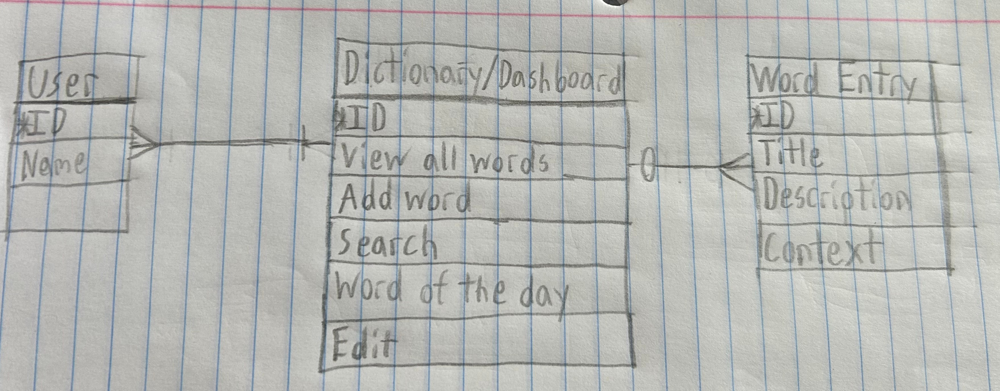

Conceptual Model Terms:

Purpose of Conceptual Model: A non-technical diagram that shows a simple visual relationship between clearly defined data points. This model does not rely on a specific database or tool and must understandable to non-technical users.

Entity: A group of data to be kept and stored. Generally of interest to the organization creating the database.

Attribute: Main characteristics of an entity.

Relationship: The association between entities. Can be 1 to 1, 1 to many, 0 to 1, etc.

Conceptual Model Description:

	Model shows three entities User, Dictionary/Dashboard, and Word Entry. The user entity only has the attributes ID and name to make the user login process simple. A user can only have one dictionary but there can be many users. Dictionary/Dashboard has the following attributes: ID, view all words, add word, search, and word of the day. A dictionary can have as little as zero word entries to many word entries. Word Entry has the following attributes: ID, title, description, and context.
