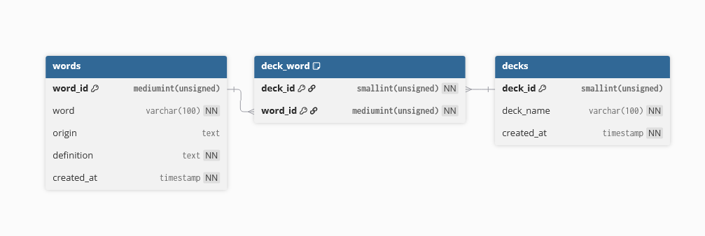
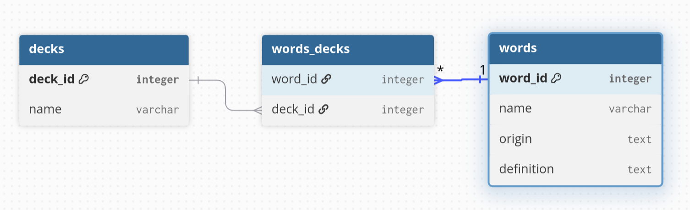

## Key difference of a Physical Model compared to a Logical Model and a Conceptual Model

A physical model includes framework specifications such as the database management system or flavor of SQL a database is going to use. A conceptual model wouldn't specify that a word has the type `VARCHAR(100)`, but a physical model would.

## Common Data Types

**INT / INTEGER:** Whole numbers. 4-byte for MariaDB.
- There's also different sizes such as TINYINT (1-byte), SMALLINT(2-byte), MEDIUMINT(3-byte),and BIGINT(8-byte).

**DECIMAL:** Exact fixed-point numbers. Usually used for precise calculations.

**VARCHAR:** Variable length character strings with a specified upper limit.

**CHAR:** Fixed length character strings with padding if necessary.

**TEXT:** Large storage for character strings. 65,535-bytes for MariaDB.
- There's different sizes such as TINYTEXT(255-byte), MEDIUMTEXT(16MB), and LONGTEXT(4GB)

**BLOB:** Stores large, variable-length binary data. Useful for storing images or other media.

**DATE:** The data in YYYY-MM-DD format.

**DATETIME:** The date and time in YYYY-MM-DD HH:MM:SS format.

**TIMESTAMP:** The date and time tied to a timezone.

## Check Constraints

Check constraints are rules applied to a column(s) that ensure the data follows a defined condition such as a falling between a numeric range.

## Group Logical Model

https://github.com/OfficeCoffee/mouseion-database/tree/group-LogicalModel/groupLogicalModelMVP

## Physical Model

We will be using auto-incrementing IDs that start at 1. As a result, the IDs for the tables are unsigned because ints are by default signed which means they include a negative to positive range of values and our IDs do not need to include a negative range. Also, since these IDs only include the positive range, their capacity is effectively doubled since the range for a signed `SMALLINT` is -32,768 to 32,767 and the range for an unsigned `SMALLINT` is 0 to 65,535.

The ID for decks is an unsigned `SMALLINT` because that is on the lower end of sizes for ints and it seems unlikely for a user to make more than 65,535 decks.

The ID for words is an unsigned `MEDIUMINT` because it can hold 3 bytes(16,777,215) of data or more than sixteen million word entries. An unsigned `SMALLINT` would be too small to capture how many words someone might store into this database. An unsigned `BIGINT` seems too big as that would account for more than eighteen quintillion possible words entries. For reference, there are around 470,000 entries in the *The Oxford English Dictionary, Second Edition* according to *Merriam-Webster* [1].

`word` and `deck_name` are `VARCHAR(100)` because they are variable length character strings that seem unlikely to go over 100. The longest word in a dictionary is pneumonoultramicroscopicsilicovolcanoconiosis which is 45 letter. There are chemical names for organic substances such as proteins which far exceed 100 characters, but those seem like outliers that probably shouldn't be included in sizing decisions [2].

`origin` is `TEXT` because it can be a large character string. It can be null because it is common for people to forget where they learned something and it seems unreasonable to force users to enter some filler text such as "N/A" or "asdanskjdnasjdnasj" because they don't remember where they heard, read, or obtained a word from. A user can forget the definition for a word, but that can be searched for on the internet.

`definition` is `text` because it can be a large character string. It is not null because the point of our application is to store words and definitions. `word` and `deck_name` have the same reasoning for not being null.

Words and decks have a `created_at` attribute because it allows for potential auditing, tracking, sorting, and general analysis of people's catalogued words and created decks. It's a `TIMESTAMP` because it will correspond to user's timezones and store the date and time.

## Sources

[1] https://www.merriam-webster.com/help/faq-how-many-english-words

[2] https://www.merriam-webster.com/wordplay/longest-words-ever

## Logical Model Documents

[Logical Model]()