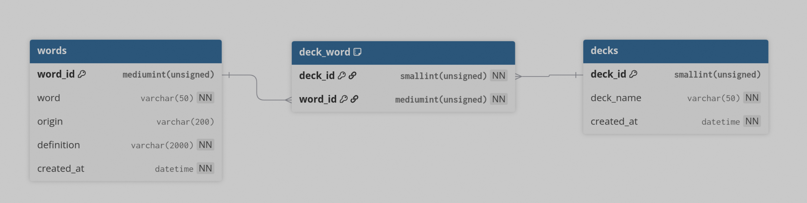
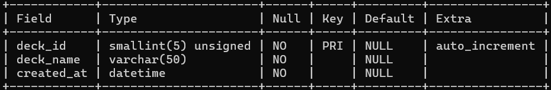

# **Questions:**
**What information should be included in a create table statement**: The name of the table, the columns, and the column restrictions/constraints

**What are database constraints and what are the benefits of them**: They are rules to limit the type of data that can be stored into the table/columns to ensure validity

**Ways to insert data**: Manual, script, insert statements (insert X from X with X) or (insert into X values X)

**What are database roles and what are they used for**: A role is something that a user can have to gain a bundle of privileges together. EX. a read only rule can allow a user to be able to read many documents at once, but not edit or execute them. It is useful for applying bulk access to many people.

**Different type of users**: Database Administrator, End Users, Programmers, System Analysts, etc.

# **Physical Model:**

# **Database:**

# **SQL:**

**Words Table**
```sql
CREATE TABLE IF NOT EXISTS `words` (
	`word_id` MEDIUMINT(8) UNSIGNED NOT NULL AUTO_INCREMENT,
	`word` VARCHAR(50) NOT NULL COLLATE 'utf8mb4_uca1400_ai_ci',
	`origin` VARCHAR(200) NULL DEFAULT NULL COLLATE 'utf8mb4_uca1400_ai_ci',
	`definition` VARCHAR(2000) NOT NULL COLLATE 'utf8mb4_uca1400_ai_ci',
	`created_at` DATETIME NOT NULL,
	PRIMARY KEY (`word_id`) USING BTREE
)
```

**Deck-Word Table**
```sql
CREATE TABLE `deck_word` (
	`word_id` MEDIUMINT(8) UNSIGNED NOT NULL,
	`deck_id` SMALLINT(5) UNSIGNED NOT NULL,
	PRIMARY KEY (`word_id`, `deck_id`) USING BTREE,
	INDEX `fk_deck_id` (`deck_id`) USING BTREE,
	CONSTRAINT `fk_deck_id` FOREIGN KEY (`deck_id`) REFERENCES `deck` (`deck_id`) ON UPDATE RESTRICT ON DELETE RESTRICT,
	CONSTRAINT `fk_word_id` FOREIGN KEY (`word_id`) REFERENCES `words` (`word_id`) ON UPDATE RESTRICT ON DELETE RESTRICT
)
```

**Decks**
```sql
CREATE TABLE `deck` (
	`deck_id` SMALLINT(5) UNSIGNED NOT NULL AUTO_INCREMENT,
	`deck_name` VARCHAR(50) NOT NULL COLLATE 'utf8mb4_uca1400_ai_ci',
	`created_at` DATETIME NOT NULL,
	PRIMARY KEY (`deck_id`) USING BTREE
)
```
